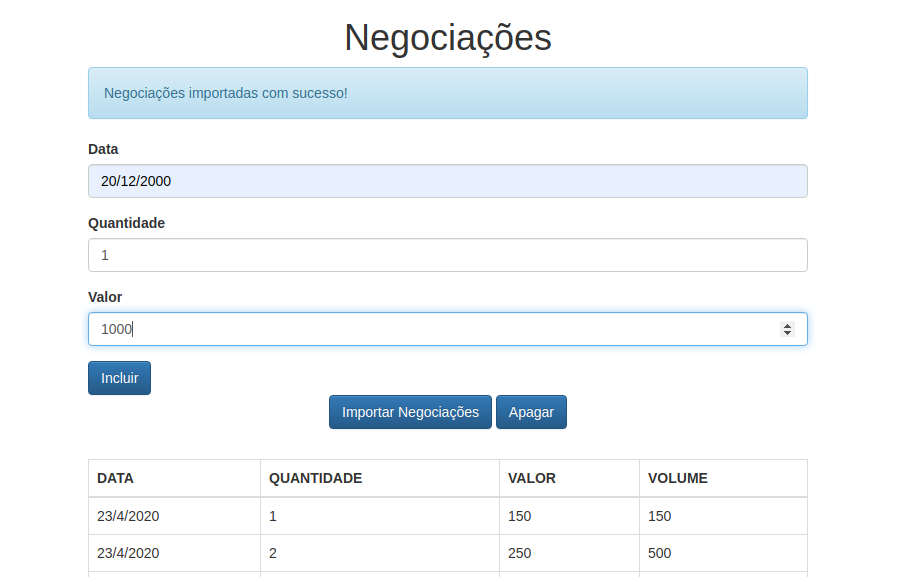

<p align="center">
    
</p>

<hr />

# Negotiations

A project based on the book [Cangaceiro Javascript](https://www.casadocodigo.com.br/products/livro-cangaceiro-javascript)

## Getting stated

This instructions will get you the project up and running on your [local machine](http://localhost:3001).

### Instaling dependencies

Inside both client and server folders run:
```
npm run install
```

### Generating client production bundle

Inside client folder run:

```
npm run bundle:prod
```

### Starting up the server

Inside server folder run:

```
npm run start
```

## Run client on development mode

Inside client folder run:

```
npm run start
```


## Built With

- [Babel](https://babeljs.io/) - Used to get access to new Javascript features
- [Webpack](https://webpack.js.org/) - Generate the bundle
- [Boostrap](https://getbootstrap.com/) - Styles the elements
- [Express](https://expressjs.com/pt-br/) - Serve api and front end application

## What i've learned

- Usage of design patterns like decorator, proxy, DAO and more 
- The importance, and how to maintain state immutable on Javascript
- The usage of IndexedDB
- How to build a webpack bundle pipeline
- How to structure a project using the MVC pattern
- Abstraction and separation of concern
- Lazy loading